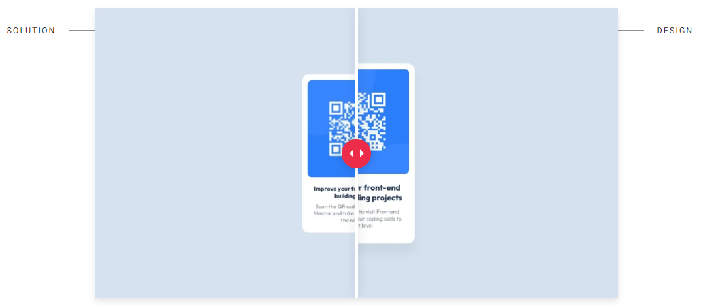

# Frontend Mentor - QR code component solution

Essa é uma solução para o desafio [QR code component challenge on Frontend Mentor](https://www.frontendmentor.io/challenges/qr-code-component-iux_sIO_H). 

## Table of contents

- [Overview](#overview)
  - [Screenshots](#screenshots)
  - [Links](#links)
- [Tecnologias utilizadas](#tecnologias-utilizadas)

## Overview

### Screenshots

### Links

- [My Solution](https://www.frontendmentor.io/solutions/qr-code-card-7XHU7A0dwc)
- [Live Site](https://guihcastro.github.io/Frontend-Mentor-QR-Code-Card/)

## Tecnologias utilizadas

-  HTML semântico;

-  CSS.